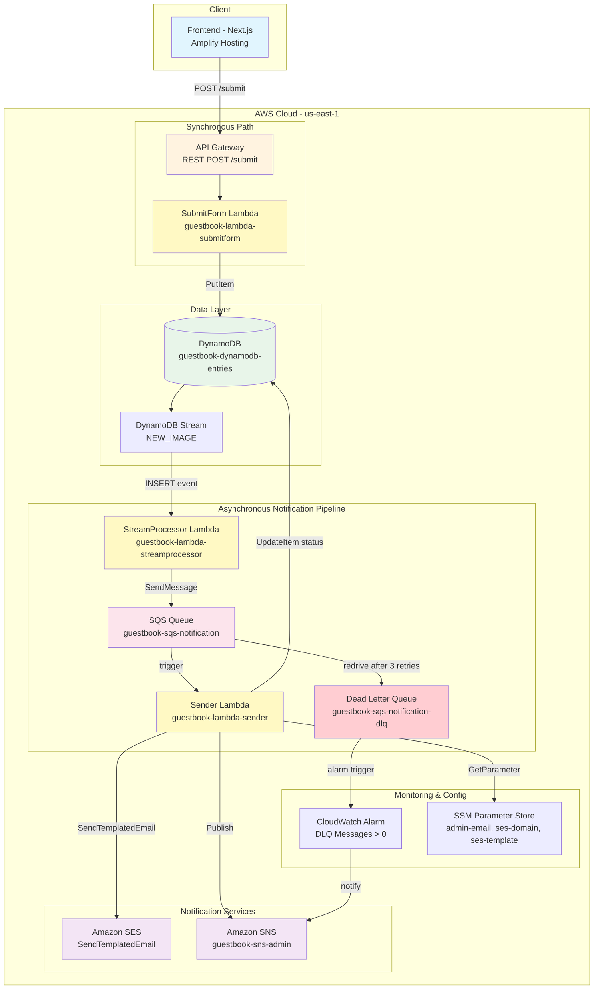
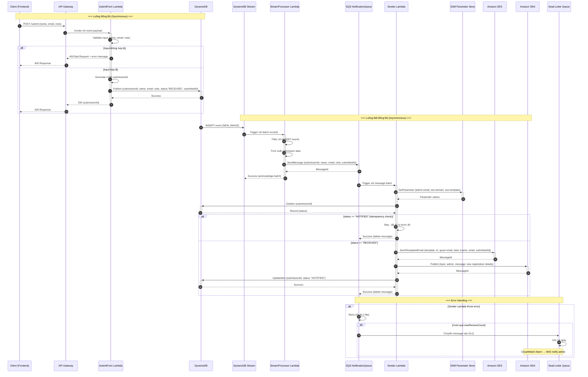
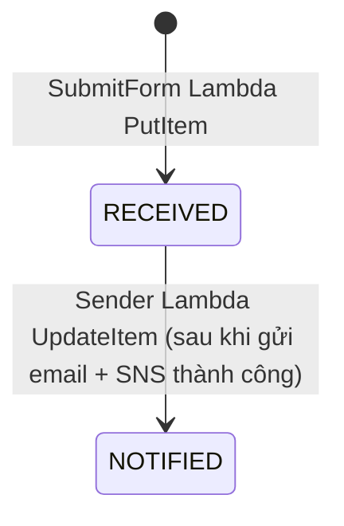

# Design Document

## Overview

Guestbook Backend là hệ thống serverless xử lý đăng ký sự kiện, được xây dựng trên AWS với kiến trúc event-driven. Hệ thống chia thành hai luồng xử lý rõ ràng:

- **Luồng đồng bộ (Synchronous)**: Client → API Gateway → SubmitForm Lambda → DynamoDB → Response trả về client ngay lập tức
- **Luồng bất đồng bộ (Asynchronous)**: DynamoDB Stream → StreamProcessor Lambda → SQS → Sender Lambda → SES/SNS

Thiết kế này đảm bảo client nhận response nhanh chóng (chỉ phụ thuộc vào thời gian ghi DynamoDB), trong khi toàn bộ pipeline notification chạy độc lập và có cơ chế retry, DLQ để đảm bảo độ tin cậy.

### Quyết định thiết kế chính

| Quyết định | Lý do |
|------------|-------|
| DynamoDB Stream thay vì gọi SQS trực tiếp từ SubmitForm | Tách biệt luồng sync/async, SubmitForm chỉ cần quyền PutItem |
| SQS giữa StreamProcessor và Sender | Buffer message, retry tự động, DLQ cho message thất bại |
| Idempotency check bằng status trong DynamoDB | Tránh gửi trùng email khi SQS retry (at-least-once delivery) |
| SSM Parameter Store cho runtime config | Thay đổi config không cần redeploy Lambda |
| Mỗi Lambda có IAM role riêng | Least-privilege, giảm blast radius nếu bị compromise |

## Architecture

### Component Diagram



### Sequence Diagram - End-to-End Flow



## Components and Interfaces

### 1. API Gateway (REST)

| Thuộc tính | Giá trị |
|------------|---------|
| Type | AWS::Serverless::Api |
| Endpoint | POST /submit |
| Integration | Lambda Proxy |
| Auth | None (public endpoint) |

Chỉ expose duy nhất một POST endpoint. Request body là JSON chứa `name`, `email`, `note`.

### 2. SubmitForm Lambda (`guestbook-lambda-submitform`)

**Nhiệm vụ**: Validate input và ghi submission vào DynamoDB.

| Thuộc tính | Giá trị |
|------------|---------|
| Runtime | Node.js 24.x (ESM - .mjs) |
| Handler | src/submitForm/index.handler |
| Memory | 128 MB |
| Timeout | 10s |
| IAM | dynamodb:PutItem trên Entries_Table |

**Interface**:
- **Input**: API Gateway event (body chứa `name`, `email`, `note`)
- **Output**: HTTP Response 200 `{submissionId}` hoặc 400/500 `{message}`

**Logic xử lý**:
1. Parse request body
2. Validate: name (required, ≤100 chars), email (required, valid format, ≤254 chars), note (optional, ≤500 chars)
3. Generate UUID v4 cho submissionId
4. PutItem vào DynamoDB với status "RECEIVED", submittedAt ISO 8601
5. Return submissionId

### 3. StreamProcessor Lambda (`guestbook-lambda-streamprocessor`)

**Nhiệm vụ**: Nhận INSERT events từ DynamoDB Stream và đẩy message vào SQS.

| Thuộc tính | Giá trị |
|------------|---------|
| Runtime | Node.js 24.x (ESM - .mjs) |
| Handler | src/streamProcessor/index.handler |
| Memory | 128 MB |
| Timeout | 30s |
| IAM | sqs:SendMessage trên NotificationQueue + DynamoDB Stream read |
| Event Source | DynamoDB Stream (Entries_Table) |
| Batch Size | 10 |
| Starting Position | LATEST |

**Interface**:
- **Input**: DynamoDB Stream event (batch of records)
- **Output**: Void (success) hoặc throw error (trigger retry)

**Logic xử lý**:
1. Iterate qua records trong batch
2. Filter: chỉ xử lý `eventName === "INSERT"`
3. Trích xuất `NewImage`: submissionId, name, email, note, submittedAt
4. SendMessage tới SQS NotificationQueue
5. Nếu SendMessage thất bại: log error + throw để DynamoDB Stream retry batch

### 4. Sender Lambda (`guestbook-lambda-sender`)

**Nhiệm vụ**: Gửi email xác nhận cho guest (SES) và thông báo admin (SNS).

| Thuộc tính | Giá trị |
|------------|---------|
| Runtime | Node.js 24.x (ESM - .mjs) |
| Handler | src/sender/index.handler |
| Memory | 128 MB |
| Timeout | 30s |
| IAM | ses:SendTemplatedEmail, sns:Publish, dynamodb:GetItem + UpdateItem, sqs:ReceiveMessage + DeleteMessage + GetQueueAttributes, ssm:GetParameter |
| Event Source | SQS (NotificationQueue) |
| Batch Size | 1 |

**Interface**:
- **Input**: SQS event (message chứa submission data)
- **Output**: Void (success) hoặc throw error (SQS retry)

**Logic xử lý**:
1. Đọc config từ SSM Parameter Store (admin email, SES domain, SES template name)
2. Validate SSM parameters (not empty, valid format)
3. Parse message body: submissionId, name, email, note, submittedAt
4. **Idempotency check**: GetItem từ DynamoDB, nếu status === "NOTIFIED" → skip
5. Gửi email xác nhận qua SES SendTemplatedEmail API
6. Publish thông báo tới Admin SNS Topic
7. UpdateItem status → "NOTIFIED" trong DynamoDB
8. Nếu bất kỳ bước nào thất bại → throw error để SQS retry

### 5. DynamoDB Table (`guestbook-dynamodb-entries`)

| Thuộc tính | Giá trị |
|------------|---------|
| Type | AWS::DynamoDB::Table |
| Billing Mode | PAY_PER_REQUEST |
| Stream | Enabled (NEW_IMAGE) |

### 6. SQS NotificationQueue (`guestbook-sqs-notification`)

| Thuộc tính | Giá trị |
|------------|---------|
| Type | AWS::SQS::Queue |
| Visibility Timeout | 180s (6x Sender Lambda timeout) |
| Message Retention | 4 days (default) |
| Redrive Policy | maxReceiveCount: 3, DLQ: guestbook-sqs-notification-dlq |

### 7. Dead Letter Queue (`guestbook-sqs-notification-dlq`)

| Thuộc tính | Giá trị |
|------------|---------|
| Type | AWS::SQS::Queue |
| Message Retention | 14 days (1.209.600 giây) |

### 8. SNS Topic (`guestbook-sns-admin`)

| Thuộc tính | Giá trị |
|------------|---------|
| Type | AWS::SNS::Topic |
| Protocol | Email (admin subscribes) |

### 9. CloudWatch Alarm

| Thuộc tính | Giá trị |
|------------|---------|
| Metric | ApproximateNumberOfMessagesVisible (DLQ) |
| Threshold | > 0 |
| Period | 60 seconds |
| Evaluation Periods | 1 |
| Action | Notify SNS Admin Topic |

### 10. SSM Parameter Store

| Parameter Path | Mô tả | Ví dụ giá trị |
|----------------|--------|----------------|
| /guestbook/admin-email | Email admin nhận thông báo | admin@example.com |
| /guestbook/ses-domain | Domain đã verify trên SES (domain trần, KHÔNG kèm local-part — Sender tự dựng `noreply@{domain}`) | example.com |
| /guestbook/ses-template-name | Tên SES email template | GuestbookConfirmation |

### 11. SES Email Template

Template được deploy tự động cùng SAM stack. Toàn bộ HTML được khai báo inline trong `backend/template.yaml`, không có file HTML riêng và không cần custom resource.

**Cấu hình triển khai**:

| Thuộc tính | Giá trị |
|------------|---------|
| Resource Type | AWS::SES::Template (khai báo trực tiếp trong SAM template) |
| Template Name | GuestbookConfirmation |
| HTML Source | Inline `HtmlPart` trong `backend/template.yaml` (YAML block scalar) |
| Deploy | Tự động cùng `sam deploy` |

**Color Palette**:

| Vai trò | Mã màu | Sử dụng |
|---------|---------|---------|
| Nền tổng thể | #0B0B12 | Background chính của email |
| Nền card/section | #151035 | Content blocks |
| Teal (accent chính) | #32EFB9 | Tiêu đề, highlight text, CTA |
| Violet (accent phụ) | #8B5CF6 | Border, divider, decorative |

**Placeholder variables** (truyền qua `TemplateData` của SendTemplatedEmail):

| Variable | Mô tả |
|----------|--------|
| `{{name}}` | Tên guest đăng ký |
| `{{email}}` | Email guest |
| `{{submittedAt}}` | Thời gian đăng ký (ISO 8601) |

**SAM Template resource definition**:

```yaml
GuestbookEmailTemplate:
  Type: AWS::SES::Template
  Properties:
    Template:
      TemplateName: GuestbookConfirmation
      SubjectPart: "Xác nhận đăng ký sự kiện"
      TextPart: |
        Xin chào {{name}},

        Cảm ơn bạn đã đăng ký tham dự sự kiện!

        Thông tin đăng ký:
        - Email: {{email}}
        - Thời gian đăng ký: {{submittedAt}}

        Chúng tôi sẽ liên hệ với bạn khi có thông tin chi tiết hơn.
      HtmlPart: |
        <!DOCTYPE html>
        <html lang="vi">
        # ... full dark-theme HTML inline ...
        </html>
```

**Lưu ý**: HTML được khai báo inline trong `HtmlPart` nên CloudFormation tự phát hiện thay đổi mỗi lần `sam deploy` — chỉ cần sửa markup trong `template.yaml`, không có file riêng phải đồng bộ. HTML dùng inline CSS (không external stylesheet) và layout table-based để tương thích với các email client. Dark theme với nền #0B0B12, card #151035, text sáng, accent teal #32EFB9 cho headings/CTA và violet #8B5CF6 cho borders/dividers.

### 12. Frontend UI (Next.js)

**Nhiệm vụ**: Giao diện đăng ký sự kiện với layout 2 cột — form bên trái, danh sách bên phải.

#### Design System

**Color Tokens**:

| Token | Dark (mặc định) | Light | Vai trò |
|-------|-----------------|-------|---------|
| `--bg-base` | #0B0B12 | #F7F7FB | Nền tổng thể |
| `--bg-card` | #151035 | #FFFFFF | Nền card/section |
| `--accent-primary` | #32EFB9 | #32EFB9 | CTA, nút hành động |
| `--accent-primary-text` | #0B0B12 | #0B0B12 (không override) | Text trên nút teal |
| `--accent-on-surface` | #32EFB9 | #5F56D9 | Accent vẽ trực tiếp lên surface: tiêu đề, focus ring, viền input khi focus |
| `--accent-secondary` | #8B5CF6 | #5F56D9 | Badge, tag, gradient trang trí (text trên nó: #FFFFFF) |
| `--text-primary` | #FFFFFF | #151035 | Text chính |
| `--text-secondary` | #8B87B3 | #6B6890 | Text phụ, placeholder |
| `--border-subtle` | rgba(139, 135, 179, 0.15) | rgba(21, 16, 53, 0.12) | Border row/divider nhẹ |
| `--input-bg` | #0B0B12 | #FFFFFF | Nền input/textarea |

#### Theme switching

- Dark là mặc định, khai báo trực tiếp trên `:root`. Light là override qua selector `[data-theme="light"]` trên `<html>`.
- Mỗi theme khai báo `color-scheme` tương ứng (`dark` / `light`) để form control và scrollbar native đi theo theme.
- Lựa chọn của người dùng được lưu trong `localStorage` dưới key `theme`.
- Khi chưa có giá trị lưu, theme khởi tạo fallback theo `prefers-color-scheme` của hệ điều hành (mặc định về dark nếu không xác định được).
- Theme được áp dụng bởi một inline script blocking trong `<head>` — script set `data-theme` trước first paint, tránh cả flash sai màu và hydration mismatch. Component `ThemeToggle` chỉ đọc `data-theme` sau khi mount (trong `useEffect`), không đọc DOM lúc render.
- `--accent-primary` giữ nguyên teal ở cả hai theme vì teal + text #0B0B12 có contrast cao ở cả hai nền, nên `--accent-primary-text` không bị override ở light mode.
- `--accent-on-surface` tách riêng khỏi `--accent-primary` vì hai vai trò khác nhau: `--accent-primary` là màu **nền** của nút (luôn teal), còn `--accent-on-surface` là accent vẽ **lên** nền trang/card. Teal trên nền light chỉ đạt ~1.3:1 nên tiêu đề và focus indicator sẽ gần như vô hình — vi phạm WCAG 2.2 SC 1.4.11 (tối thiểu 3:1 cho non-text indicator). Light mode dùng #5F56D9, đạt ~5.4:1 trên #F7F7FB.
- `--accent-secondary` ở light mode dùng violet đậm hơn (#5F56D9 thay vì #8B5CF6): violet gốc trên nền trắng chỉ đạt ~3.9:1 với text #FFFFFF, dưới ngưỡng WCAG AA 4.5:1 cho status badge cỡ 12px; #5F56D9 đạt ~5.6:1.

**Typography**:

| Vai trò | Font | Weight |
|---------|------|--------|
| Heading | Space Grotesk | 600-700 |
| Body | Inter | 400-500 |
| Mono (code/ID) | JetBrains Mono | 400 |

**Ràng buộc visual**:
- Mỗi màn hình chỉ 1 nút teal (#32EFB9) làm primary CTA
- Violet (#8B5CF6) chỉ dùng cho badge/tag/gradient trang trí, không dùng làm nền nút chính
- Teal và violet không đặt cạnh nhau trên diện tích lớn
- Nút chuyển theme (`ThemeToggle`) là secondary: nền trong suốt + border `--border-subtle`, không dùng nền teal, để giữ đúng ràng buộc "1 nút teal mỗi màn hình"
- Input fields: nền `--input-bg`, border `--text-secondary` (focus: border teal)
- Danh sách submissions: mỗi row trên nền `--bg-card`, border `--border-subtle`, status badge dùng `--accent-secondary`

#### Layout

```
┌─────────────────────────────────────────────────────┐
│  Header: "Guestbook" (Space Grotesk, teal accent)   │
├────────────────────────┬────────────────────────────┤
│  FORM (bên trái)       │  DANH SÁCH (bên phải)     │
│                        │                            │
│  [Name]                │  ┌──────────────────────┐  │
│  [Email]               │  │ Tên | Note | Status  │  │
│  [Note]                │  ├──────────────────────┤  │
│                        │  │ Nguyễn A | ... | ●   │  │
│  [Submit - teal CTA]   │  │ Trần B   | ... | ●   │  │
│                        │  └──────────────────────┘  │
├────────────────────────┴────────────────────────────┤
│  Footer (text-secondary)                            │
└─────────────────────────────────────────────────────┘
```

#### API Integration

| Action | Endpoint | Thời điểm |
|--------|----------|-----------|
| Load danh sách | GET /submissions | Khi trang load |
| Submit form | POST /submit | Khi user nhấn CTA |

**Optimistic update**: Sau khi POST thành công (nhận submissionId), frontend thêm entry mới vào đầu danh sách local với status "RECEIVED" mà không gọi lại GET.

### 13. GetSubmissions Lambda (`guestbook-lambda-getsubmissions`)

**Nhiệm vụ**: Trả về danh sách tất cả submissions từ DynamoDB.

| Thuộc tính | Giá trị |
|------------|---------|
| Runtime | Node.js 24.x (ESM - .mjs) |
| Handler | src/getSubmissions/index.handler |
| Memory | 128 MB |
| Timeout | 10s |
| IAM | dynamodb:Scan trên Entries_Table |

**Interface**:
- **Input**: API Gateway event (GET /submissions)
- **Output**: HTTP Response 200 `{submissions: [...]}` hoặc 500 `{message}`

**Logic xử lý**:
1. Scan toàn bộ Entries_Table
2. Sort kết quả theo submittedAt giảm dần (mới nhất đầu)
3. Map mỗi item: {submissionId, name, note, status, submittedAt}
4. Return mảng submissions (mảng rỗng nếu không có data)

## Data Models

### DynamoDB Table Schema (`guestbook-dynamodb-entries`)

| Attribute | Type | Key | Mô tả |
|-----------|------|-----|--------|
| submissionId | String (UUID v4) | Partition Key (PK) | ID duy nhất cho mỗi submission |
| name | String | - | Tên người đăng ký (1-100 ký tự) |
| email | String | - | Email người đăng ký (≤254 ký tự, format: local@domain.tld) |
| note | String | - | Ghi chú tùy chọn (≤500 ký tự, có thể rỗng) |
| status | String | - | Trạng thái: "RECEIVED" → "NOTIFIED" |
| submittedAt | String (ISO 8601) | - | Thời điểm submit, VD: "2024-01-15T10:30:00.000Z" |

**Trạng thái chuyển đổi (State Machine)**:



### SQS Message Format (NotificationQueue)

Message body là JSON string:

```json
{
  "submissionId": "550e8400-e29b-41d4-a716-446655440000",
  "name": "Nguyễn Văn A",
  "email": "nguyenvana@example.com",
  "note": "Tôi sẽ đến sớm 30 phút",
  "submittedAt": "2024-01-15T10:30:00.000Z"
}
```

| Field | Type | Required | Mô tả |
|-------|------|----------|--------|
| submissionId | String (UUID) | Yes | PK để lookup DynamoDB |
| name | String | Yes | Tên guest |
| email | String | Yes | Email guest (destination cho SES) |
| note | String | Yes | Ghi chú (có thể rỗng "") |
| submittedAt | String (ISO 8601) | Yes | Timestamp đăng ký |

### SNS Message Format (Admin Notification)

```json
{
  "subject": "Đăng ký mới: Nguyễn Văn A",
  "message": "Có đăng ký mới!\n\nTên: Nguyễn Văn A\nEmail: nguyenvana@example.com\nThời gian: 2024-01-15T10:30:00.000Z\nSubmission ID: 550e8400-e29b-41d4-a716-446655440000"
}
```

### API Request/Response Format

**Request** (POST /submit):
```json
{
  "name": "Nguyễn Văn A",
  "email": "nguyenvana@example.com",
  "note": "Tôi sẽ đến sớm 30 phút"
}
```

**Response 200** (Success):
```json
{
  "submissionId": "550e8400-e29b-41d4-a716-446655440000"
}
```

**Response 400** (Validation Error):
```json
{
  "message": "Email là bắt buộc"
}
```

**Response 500** (Server Error):
```json
{
  "message": "Đã xảy ra lỗi, vui lòng thử lại sau"
}
```


## Correctness Properties

*A property is a characteristic or behavior that should hold true across all valid executions of a system—essentially, a formal statement about what the system should do. Properties serve as the bridge between human-readable specifications and machine-verifiable correctness guarantees.*

### Property 1: Valid Submission Round-Trip

*For any* valid combination of name (1-100 ký tự, không chỉ whitespace), email (format hợp lệ, ≤254 ký tự), và note (≤500 ký tự hoặc rỗng), khi gọi SubmitForm handler thì response PHẢI có statusCode 200, body chứa UUID hợp lệ dạng submissionId, và bản ghi trong DynamoDB PHẢI chứa đúng các trường name, email, note, status "RECEIVED", và submittedAt dạng ISO 8601.

**Validates: Requirements 1.1, 1.5**

### Property 2: Missing/Whitespace Required Fields Rejected

*For any* string chỉ chứa ký tự whitespace (spaces, tabs, newlines, hoặc chuỗi rỗng) được dùng làm giá trị cho trường name hoặc email, khi gọi SubmitForm handler thì response PHẢI có statusCode 400 và message chỉ ra trường bắt buộc bị thiếu. Không có bản ghi nào được tạo trong DynamoDB.

**Validates: Requirements 1.2, 1.3**

### Property 3: Invalid Email Format Rejected

*For any* string không khớp pattern `local-part@domain` (trong đó domain có ít nhất một dấu chấm), khi gọi SubmitForm handler với string đó làm email thì response PHẢI có statusCode 400 và message chỉ ra email không đúng định dạng.

**Validates: Requirements 1.4**

### Property 4: Field Length Validation

*For any* input trong đó name > 100 ký tự, hoặc email > 254 ký tự, hoặc note > 500 ký tự, khi gọi SubmitForm handler thì response PHẢI có statusCode 400 và message chỉ ra trường nào vượt quá độ dài cho phép.

**Validates: Requirements 1.7**

### Property 5: DynamoDB Stream INSERT Event Transformation

*For any* DynamoDB Stream event có eventName "INSERT" chứa NewImage với submissionId, name, email, note, submittedAt hợp lệ, khi StreamProcessor handler xử lý thì SQS message PHẢI chứa đúng 5 trường đó với giá trị khớp chính xác từ NewImage.

**Validates: Requirements 2.1**

### Property 6: Non-INSERT Events Filtered

*For any* DynamoDB Stream event có eventName là "MODIFY" hoặc "REMOVE", khi StreamProcessor handler xử lý thì KHÔNG có message nào được gửi tới SQS NotificationQueue.

**Validates: Requirements 2.3**

### Property 7: Successful Notification Pipeline

*For any* SQS message hợp lệ chứa submissionId, name, email, note, submittedAt — trong đó bản ghi DynamoDB có status "RECEIVED" — khi Sender handler xử lý thì: (a) SES SendTemplatedEmail PHẢI được gọi với template data chứa name, email, submittedAt gửi tới email của guest, (b) SNS Publish PHẢI được gọi tới Admin Topic chứa thông tin guest, và (c) DynamoDB UpdateItem PHẢI cập nhật status sang "NOTIFIED".

**Validates: Requirements 3.1, 3.2, 3.3**

### Property 8: Idempotency — Skip Already Notified

*For any* SQS message chứa submissionId mà bản ghi tương ứng trong DynamoDB đã có status "NOTIFIED", khi Sender handler xử lý thì KHÔNG gọi SES SendTemplatedEmail, KHÔNG gọi SNS Publish, và KHÔNG gọi DynamoDB UpdateItem.

**Validates: Requirements 3.4**

### Property 9: Invalid SSM Configuration Rejected

*For any* giá trị SSM parameter rỗng, hoặc admin email không đúng format email hợp lệ, hoặc sender domain không đúng format domain, khi Sender handler đọc config thì PHẢI throw error và không gọi SES hay SNS.

**Validates: Requirements 6.5, 6.6**

## Error Handling

### SubmitForm Lambda

| Tình huống lỗi | Response | Hành vi |
|----------------|----------|---------|
| Input validation thất bại | 400 + message cụ thể | Không ghi DynamoDB, trả message mô tả lỗi |
| DynamoDB PutItem thất bại | 500 + message chung | Log chi tiết lỗi, trả message generic không tiết lộ internals |
| Request body không parse được (invalid JSON) | 400 + message | Trả thông báo body không hợp lệ |

### StreamProcessor Lambda

| Tình huống lỗi | Hành vi |
|----------------|---------|
| SQS SendMessage thất bại | Log error (error message, submissionId, timestamp), throw error → DynamoDB Stream retry batch |
| Invalid record format trong Stream event | Log warning, skip record, tiếp tục xử lý records còn lại |

### Sender Lambda

| Tình huống lỗi | Hành vi |
|----------------|---------|
| SSM parameter thiếu hoặc không truy cập được | Throw error với message chỉ rõ parameter nào → SQS retry |
| SSM parameter rỗng hoặc format không hợp lệ | Throw error → SQS retry |
| DynamoDB GetItem thất bại | Throw error → SQS retry |
| submissionId không tồn tại trong DynamoDB | Throw error → SQS retry |
| SES SendTemplatedEmail thất bại | Throw error → SQS retry (max 3 lần, rồi vào DLQ) |
| SNS Publish thất bại (sau khi SES thành công) | Throw error → SQS retry. Lần retry tiếp theo idempotency check sẽ detect status vẫn "RECEIVED", gửi lại email (acceptable vì SES có deduplication ngắn hạn) |
| DynamoDB UpdateItem thất bại (sau SES+SNS thành công) | Throw error → SQS retry. Idempotency: nếu status chưa update thành "NOTIFIED", retry sẽ gửi lại (worst case: duplicate email) |

### Retry Strategy

```
Message → Sender Lambda
  ├── Success → Delete message từ queue
  ├── Failure (lần 1) → Message visible lại sau visibility timeout (180s)
  ├── Failure (lần 2) → Message visible lại
  └── Failure (lần 3) → Chuyển vào DLQ → CloudWatch Alarm → SNS notify admin
```

## Testing Strategy

### Phương pháp kiểm thử kép (Dual Testing Approach)

Hệ thống sử dụng kết hợp **unit tests** (ví dụ cụ thể) và **property-based tests** (kiểm chứng thuộc tính phổ quát) để đảm bảo độ bao phủ toàn diện.

### Property-Based Testing

**Library**: [fast-check](https://github.com/dubzzz/fast-check) (JavaScript/TypeScript PBT library)

**Cấu hình**:
- Minimum 100 iterations mỗi property test
- Mỗi test PHẢI tag theo format: `Feature: guestbook-backend, Property {number}: {title}`

**Scope**: Property tests áp dụng cho business logic của 3 Lambda functions:
- SubmitForm: Input validation logic (Properties 1-4)
- StreamProcessor: Event filtering và message transformation (Properties 5-6)
- Sender: Notification pipeline và idempotency (Properties 7-9)

**Không áp dụng PBT cho**: IAM policies, DLQ configuration, CloudWatch Alarm, SAM template structure (dùng snapshot/smoke tests thay thế).

### Unit Tests (Example-Based)

| Component | Test Cases |
|-----------|-----------|
| SubmitForm | DynamoDB write failure → 500 response |
| StreamProcessor | SQS SendMessage failure → throw error with log |
| Sender | SES failure → throw error |
| Sender | SNS failure after SES success → throw error |
| Sender | submissionId not found → throw error |
| Sender | SSM parameter missing → throw error with parameter name |

### Integration Tests

| Scenario | Mô tả |
|----------|--------|
| End-to-end happy path | POST /submit → verify DynamoDB record → verify SQS message format |
| SSM parameter read | Verify Sender reads correct SSM paths |

### Infrastructure Tests (Smoke/Snapshot)

| Test | Mô tả |
|------|--------|
| SAM template validation | `sam validate` pass |
| cfn-lint | CloudFormation linting |
| IAM least privilege check | Verify each role chỉ có permissions cần thiết |
| DLQ redrive policy | maxReceiveCount = 3, retention = 14 days |
| CloudWatch Alarm config | Metric, threshold, action đúng |

### Test Structure

```
backend/
├── src/
│   ├── submitForm/
│   │   └── index.mjs
│   ├── streamProcessor/
│   │   └── index.mjs
│   └── sender/
│       └── index.mjs
├── tests/
│   ├── unit/
│   │   ├── submitForm.test.mjs
│   │   ├── streamProcessor.test.mjs
│   │   └── sender.test.mjs
│   ├── property/
│   │   ├── submitForm.property.mjs      # Properties 1-4
│   │   ├── streamProcessor.property.mjs  # Properties 5-6
│   │   └── sender.property.mjs          # Properties 7-9
│   └── integration/
│       └── e2e.test.mjs
└── package.json
```
